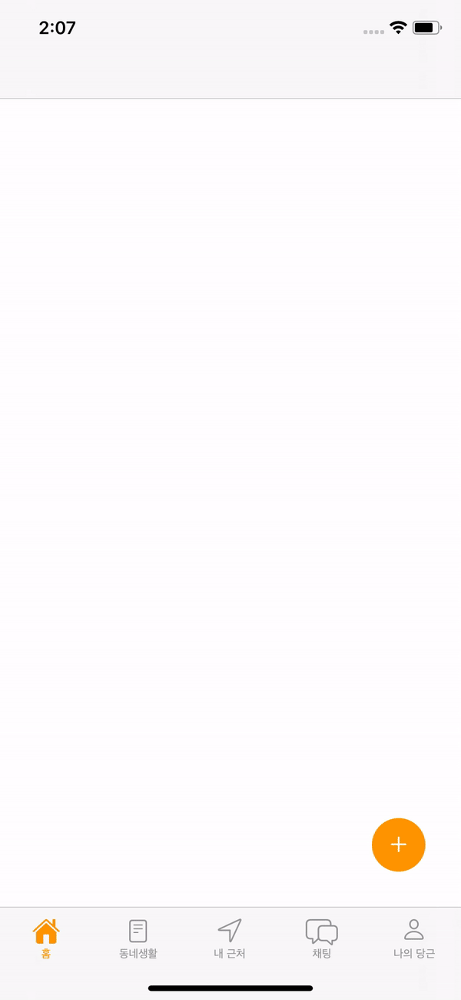
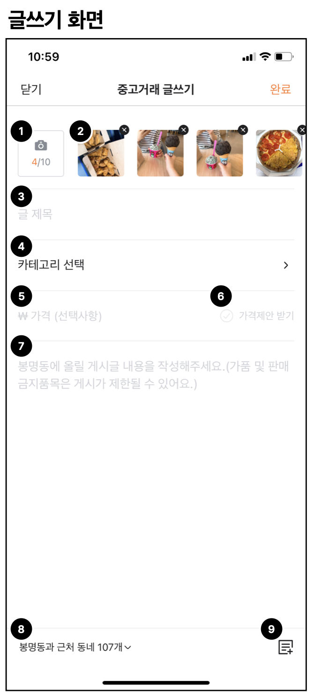
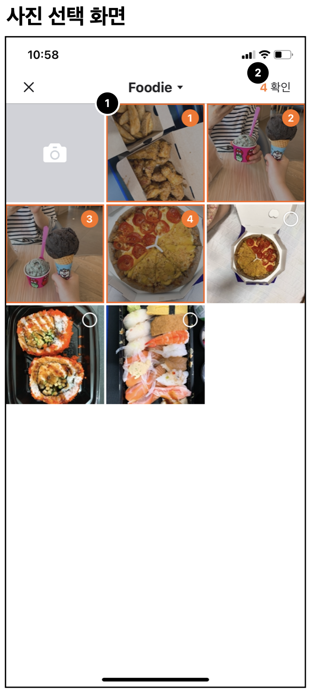
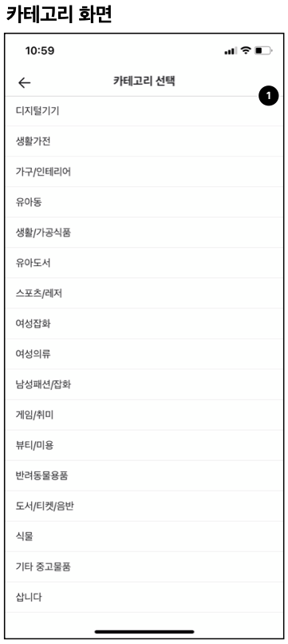
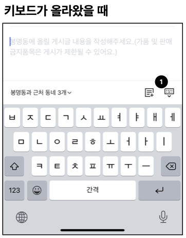
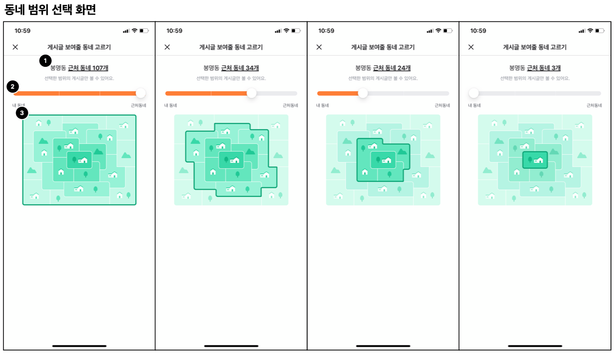
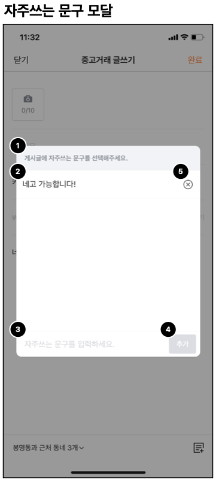

# 당근마켓 중고거래 작성 화면 클론 코딩

당근마켓 중고거래 작성 화면을 구현했습니다.

## Requirements

- Swift 5
- iOS 13+
- Xcode 12

## Dependencies

- RxSwift, 6.1.0
- RxCocoa, 6.1.0
- RxDataSources, 5.0.0
- SwiftLint, 0.43.1
- SnapKit, ~> 5.0.0
- Then, 2.7.0

## 동작 화면

## 구현

- `TableView`를 이용해서 화면을 구성했습니다.
  - 셀 마다 타입이 있고, 타입에 맞는 `CustomCell`을 표시하게 만들었습니다.
  - 썸네일을 보여주는 셀은 내부에 컬렉션 뷰를 사용했습니다.
- 사진 권한이 허용되었으면, 앨범에 있는 모든 이미지의 썸네일을 가져와서 보여줍니다.
  - 사용자가 직접 이미지를 선택하는 부분을 구현하지 못했습니다.
- 가격 입력 항목에서 99,999,999원을 초과한 경우 99,999,999원으로 고정해서 보여줍니다.
  - 가격을 입력하지 않았으면, 가격제안 받기 버튼이 비활성화 됩니다.

## 아쉬웠던 점

- 다시 만든다면 `TableView`를 이용하지 않고, `StackView`로 구성할 거 같습니다.
- `WriteViewController`가 너무 많은 일을 하고 있습니다. `RxSwift`를 사용했지만, 제대로 이점을 살리지 못했습니다. 계속 진행한다면, `RxSwift`를 걷어내거나, 로직을 `ViewModel`로 분리하려 합니다.
- 키보드가 올라올 때, 툴 바가 가려지는 문제를 해결하지 못했습니다.
- 진행 속도가 더뎌서 요구사항 분석과 달리 전부 구현하지 못했습니다.

## 추가 구현
- 키보드가 올라올 때, 툴 바가 가려지는 문제를 해결했습니다.
  - iOS 15+
    - `view.keyboardLayoutGuide.topAnchor`로 오토 레이아웃을 걸면 해결된다.
  - ~ iOS 14
    - `NotificationCenter.default.addObserver(self, selector: #selector(keyboardWillShow(_ :)), name: UIResponder.keyboardWillShowNotification, object: nil)`로 알림을 받아서 설정해야 한다. 
    - `toolbar`의 `bottomConstraint.offset(-keyboardFrame.height)`를 업데이트 하는 식으로 해결했습니다.

## 요구사항 분석

### 요구사항
1. 사진 선택 화면으로 이동한다.
   - 현재 선택된 사진의 개수를 표시한다.
2. 현재 선택된 사진을 가로로 나열해 표시한다.
   - 썸네일을 선택하면 원본 사진을 보여준다.
   - X를 선택하면 사진을 삭제한다.
3. 글 제목을 입력 받는다.
   - 글자 수가 늘어나면 입력폼이 한 줄씩 늘어난다.
   - 글 제목에 따라 카테고리를 추천해준다. (구현 X)
4. 카테고리 선택 화면으로 이동한다.
5. 숫자 키보드로 가격을 입력 받는다.
    - 99,999,999원을 초과하면 99,999,999원으로 고정한다.
6. 가격이 입력되지 않으면 활성화하지 않는다.
7. 게시글 내용을 입력 받는다.
8. 동네 범위 선택 화면으로 이동한다.
9. 자주 사용하는 문구 모달을 띄운다.

### 요구사항

1. 여러장의 사진을 선택할 수 있다.
2. 선택한 사진의 개수를 표시한다.
    - 선택한 사진을 글쓰기 작성 화면으로 넘겨준다.

### 요구사항

1. 카테고리 목록을 표시한다.

### 요구사항

1. 키보드가 올라왔을 때 키보드를 숨기는 버튼을 표시한다.

### 요구사항

1. 선택한 범위에 따라 텍스트를 변경한다.
2. 슬라이더를 이용해 동네 범위를 선택한다.
3. 2에서 조절한 범위에 따라 이미지를 변경한다.

### 요구사항

1. 모달 타이틀을 표시한다.
2. 자주쓰는 문구 목록을 표시한다.
3. 자주쓰는 문구를 입력 받는다.
4. 텍스트가 없으면 비활성화한다.
5. 선택하면 현재 문구를 삭제한다.
